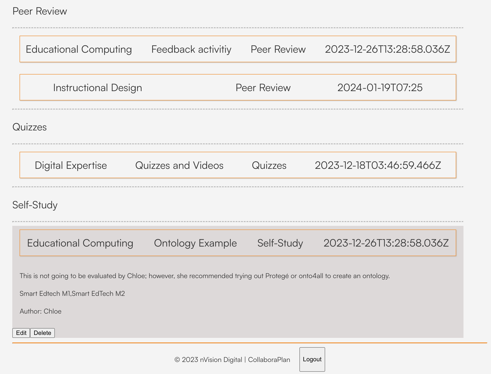

# Coplanner

Coplanner is the official repository of the CollaboraPlan application.
The project has been developed using VueJS 3 and Firebase on the VSCode IDE.


## What is CollaboraPlan

This is a platform that enables synchronous planning in academic and professional settings.

## How To Use The App

The applications offers two main views namely:

* Authentication: This view hosts the login and registration subviews as highlighted below.


* Dashboard: This view host an admin and standard view which is based on the role assigned to the user. The admin role allows for performing CRUD operations. The standard mode purely serves as a consumer of the saved data.




Optionally, the application offers an About page.

## Contributing

The application is licenced under the MIT licence. 
Feel free to contribute and ake use of the resources provided accordingly.

### Customize configuration

See [Vite Configuration Reference](https://vitejs.dev/config/).

### Project Setup

```sh
npm install
```

#### Compile and Hot-Reload for Development

```sh
npm run dev
```

#### Compile and Minify for Production

```sh
npm run build
```
